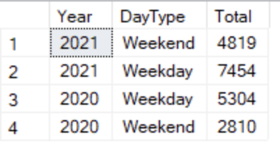

# SQL Data Analysis

### Problem Statement
The aim of this project is to analyze the performance of the cafes online business over the past two years with the goal of increasing its customer base online. 
#### Data Analysis Using SQL 
* Show total revenue in the year 2020
* Show Weekdays/Weekends, customer count
* Show Top-selling products per day
* Show cafe sales per year etc.

### About Datasets
The dataset contains the transaction details for customers who ordered different items from Cafe between 2020 and 2021. Moreover, the Itemsandprice dataset contains the price for each item.

### Sample Output
#### Weekdays/Weekends Customer Count?

  
  
